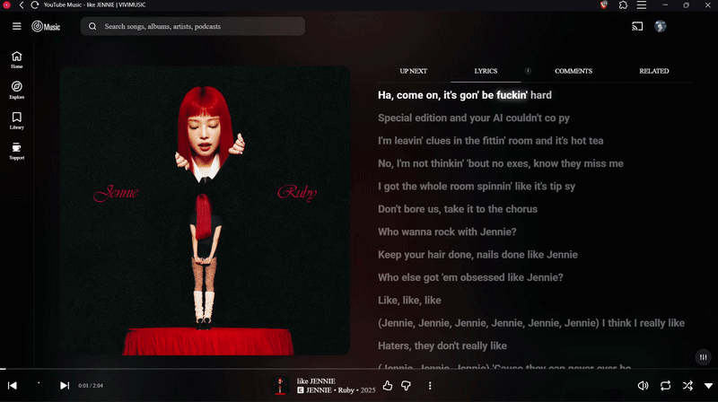

<div align="center">


# Vivimusic Web

**Apple Music–style Canvas artwork, synced lyrics, Last.fm scrobbling, and a full visual overhaul for YouTube Music.**


</div>

---

Vivimusic Web is a browser extension that reskins **[music.youtube.com](https://music.youtube.com)** with animated Canvas-style backgrounds (like Apple Music/Spotify Canvas), word-synced lyrics, an audio equalizer, Sponsorblock skipping, Last.fm scrobbling, and a dark, glassy theme — without needing a separate desktop app or a Chrome Web Store install.

This extension is **not published on the Chrome Web Store**. It's distributed as source from this repository and loaded manually as an "unpacked" extension. Follow the installation guide below — it takes about a minute.

---

## Watch the Extension in Action

<div align="center">

<a href="https://files.catbox.moe/ycpt9e.mp4">
  
</a>

**Click the preview above to watch the full video** 

</div>

---

## Table of Contents

- [Watch the Extension in Action](#watch-the-extension-in-action)
- [Features](#features)
- [Installation Guide](#installation-guide)
  - [Chrome / Brave / Vivaldi / Opera](#chrome--brave--vivaldi--opera)
  - [Microsoft Edge](#microsoft-edge)
  - [Firefox](#firefox)
- [Updating](#updating)
- [Settings](#settings)
- [Spotify Canvas Login](#spotify-canvas-login)
- [Last.fm Scrobbling](#lastfm-scrobbling)
- [Permissions & Privacy](#permissions--privacy)
- [Troubleshooting](#troubleshooting)
- [Credits](#credits)
- [License](#license)

---

## Features

- 🎨 **Canvas Artwork** — Fetches animated, Apple Music–style Canvas videos (or high-res artwork as a fallback) for the currently playing song and blends it into the player thumbnail and page background.
- 🖼️ **Spotify Canvas** — Spotify Canvas support for YT Music songs. Connect either with a one-click Spotify login or by pasting your `sp_dc` cookie manually (useful on browsers like Brave where the popup login flow needs an extra step — see [Spotify Canvas Login](#spotify-canvas-login)).
- 🌊 **Kawarp Background Engine** — The animated Canvas background is fully tunable from the popup: opacity, warp intensity, blur passes, saturation, dithering, animation speed, and transition duration all have live sliders, plus a "pause when inactive" toggle and a one-click **Reset to defaults** button. There's also an "artwork/image-only" mode if you'd rather skip the warped background animation entirely and just show static art.
- 🎚️ **Built-in Equalizer** — A toggleable audio equalizer for YouTube Music playback.
- 🎤 **Synced Lyrics** — Word-synced lyrics when available, falling back to line-synced, then plain lyrics. Pulled from multiple providers so you almost always get *something*.
- 🔀 **Multiple Lyrics Providers** — Toggle individual sources on or off:
  - BetterLyrics (word-sync / TTML)
  - BetterLyrics (Kugou)
  - BetterLyrics (Legacy)
  - LRCLIB
  - Spotify
  - Musixmatch
  - Unison
- 📑 **Auto-open Lyrics Tab** — Optionally jumps straight to the Lyrics tab when a track starts.
- 🎬 **Lyrics on Video Tracks** — Toggle whether the synced lyrics panel also shows up for tracks played as music videos, not just audio-only songs.
- 🥇 **Lyrics Provider Priority** — Reorder and prioritize which lyrics provider is tried first, with an optional "wait for priority source" toggle before falling back to others.
- 🎶 **Lyrics Offset** — Adjust the lyrics timeline sync per-track (saved locally).
- 💃 **REZE Dance** — An animated dancer plays when no lyrics can be found for a track, toggleable in the popup.
- ⏭️ **Sponsorblock** — Automatically skips non-music segments (intros, sponsor spots, etc.) using Sponsorblock data.
- 🎧 **Last.fm Scrobbling** — Logs in with your Last.fm username and password (no browser redirect needed) and scrobbles what you listen to, sends Now Playing status, and syncs Likes/Unlikes as Loves/Unloves on Last.fm.
- 💾 **Local Artwork Cache** — Previously fetched artwork/Canvas videos are cached locally so repeat plays load instantly. Viewable and clearable from the popup.
- 🦁 **Brave Browser Fix Guide** — A built-in walkthrough (accessible from an info button in the popup) for resolving Spotify login quirks specific to Brave's shields/cookie handling.
- 🎨 **THEME** — A full dark, glassy visual reskin of YouTube Music, toggleable independently of Canvas and Lyrics.
- 🔔 **Update Checker** — Since this isn't on the Web Store, the popup can check this GitHub repo's [Releases](../../releases) page and let you know when a newer version is out (see [Updating](#updating) — it notifies you, it does not auto-install).

---

## Installation Guide

> Because this extension isn't listed on any extension store, your browser will warn you that it's an "unpacked" / "developer mode" extension. That's expected and normal — it just means you installed it from source instead of a store.

### Chrome / Brave / Vivaldi / Opera

1. **Download The Zipfile From Releases**
2. **Extract it** to a folder you won't move or delete later (e.g. `Documents/Vivimusic Web`). Chrome loads the extension directly from this folder, so if you delete it, the extension breaks.
3. Open your browser and go to:
   ```
   chrome://extensions
   ```
   (For Brave: `brave://extensions` · For Vivaldi: `vivaldi://extensions` · For Opera: `opera://extensions`)
4. Turn on **Developer mode** — the toggle is in the top-right corner of the extensions page.
5. Click **Load unpacked**.
6. Select the folder you extracted and open the folder you will see icon and src folder when you see these two folders dont click on them just click open to select (the one that directly contains `manifest.json`).
7. Vivimusic Web should now appear in your extensions list and in your toolbar. Open **[music.youtube.com](https://music.youtube.com)**, play a song, and you should see the new theme and Canvas artwork kick in within a second or two.

### Microsoft Edge

Same as above, using `edge://extensions` instead of `chrome://extensions`. Edge calls the same feature **Developer mode**, in the left sidebar.

### Firefox

This extension is built for Manifest V3 (Chromium-based browsers) and is **not currently packaged for Firefox**. Loading it as a temporary add-on via `about:debugging` may partially work, but some features (like the background service worker) are not guaranteed to behave the same way. Chromium-based browsers are recommended.

---

## Updating

 To update Vivimusic Web:

1. Open the extension popup — if a newer version is available, you'll see an **"Update available"** notice (checked automatically twice a day, or manually via **Check for updates** in the popup).
2. Download the latest release from the [Releases page](../../releases) (or pull the latest `main` branch).
3. Extract it and again load unpack it then it will be updated .
That's it — no need to remove and re-add the extension.

---

## Settings

All settings live in the extension popup (click the Vivimusic icon in your toolbar):

| Setting | What it does |
|---|---|
| **Enable Canvas** | Turns the animated artwork/background feature on or off. |
| **Image only** | Shows static artwork instead of the animated warped Canvas background. |
| **Kawarp background** | Enables the animated warp effect, with an expandable panel of fine-tuning sliders: opacity, warp intensity, blur passes, saturation, dithering, animation speed, transition duration, plus a "pause when inactive" toggle and a **Reset to defaults** button. |
| **Equalizer** | Turns the built-in audio equalizer on or off. |
| **Synced Lyrics** | Turns the custom lyrics panel on or off. |
| **Auto-open Lyrics tab** | Automatically switches to the Lyrics tab when a new track starts. |
| **Lyrics on video tracks** | Shows the synced lyrics panel for tracks played as music videos, not just audio. |
| **REZE Dance on no lyrics found** | Plays the animated dancer when no lyrics can be found for a track. |
| **Sponsorblock** | Automatically skips non-music segments using Sponsorblock data. |
| **Lyrics providers** | Toggle individual lyrics sources on/off, in priority order. |
| **Prioritize provider** | Enables custom lyrics provider priority ordering, with a "wait for priority source" toggle. |
| **THEME** | Toggles the full visual reskin independently of Canvas/Lyrics. |
| **Spotify Canvas** | Enables Spotify Canvas videos for YT Music tracks; connect via login or `sp_dc` cookie. |
| **Last.fm scrobbling** | Turns Last.fm integration on or off entirely. |
| **Send Now Playing** | Sends a "Now Playing" update to Last.fm as soon as a track starts. |
| **Send Likes/Unlikes** | Mirrors the YouTube Music like button to Last.fm Love/Unlove. |
| **Min. song length (sec)** | Tracks shorter than this are never scrobbled. |
| **Scrobble delay (%)** | Scrobble once this percentage of the track has played. |
| **Scrobble delay (min)** | Or once this many minutes have played — whichever threshold is reached first. |
| **Artwork Cache** | Shows how many songs are cached locally, with a one-click **Clear all**. |
| **Check for updates** | Manually checks this repo's latest release against your installed version. |

---

## Spotify Canvas Login

To get Spotify Canvas videos on YouTube Music tracks, connect a Spotify account from the popup in one of two ways:

1. **Connect Spotify** — click the button and log in normally.
2. **Paste `sp_dc` cookie** — if the one-click login doesn't work for your browser (this is common on **Brave**, due to its cookie/shield handling), paste your Spotify `sp_dc` cookie value into the field and click **Save sp_dc locally**. It's stored locally in your browser only.

If you're on Brave and hitting login issues, click the **"Using Brave Browser?"** info button in the popup for a step-by-step fix guide built into the extension.

Once connected, you'll see your connected account shown in the popup with a **Disconnect Spotify** option to revoke access at any time.

---

## Last.fm Scrobbling

Vivimusic Web can scrobble what you listen to on YouTube Music straight to your Last.fm profile.

**Logging in:**
1. Open the popup and switch on **Last.fm scrobbling**.
2. Enter your Last.fm **username** and **password** and click **Connect Last.fm account**.
3. Your password is sent once, directly to Last.fm's own API, and is never stored — only the session token Last.fm returns is saved locally, and it can be revoked any time from your Last.fm account's **Applications** settings without changing your password.

**How scrobble timing works:**
A track is scrobbled once it has played past *whichever comes first*:
- the configured **percentage** of its total duration, or
- the configured **number of minutes**,

as long as the track is longer than the configured **minimum song length**. These three thresholds are all adjustable in the popup.

**Likes/Unlikes:**
When enabled, liking or unliking a song in YouTube Music sends a matching Love/Unlove to Last.fm.

---

## Permissions & Privacy

Vivimusic Web only requests what it needs to function, and only runs on `music.youtube.com`:

| Permission | Why it's needed |
|---|---|
| `storage`, `unlimitedStorage` | Saves your settings and caches artwork locally, in your browser only. |
| `activeTab`, `tabs` | Detects the current track and communicates between the popup and the YouTube Music tab. |
| `alarms` | Schedules the twice-daily background check for new releases on GitHub. |
| `cookies` | Used only for Spotify Canvas login (reading/managing the `sp_dc` session cookie needed to fetch Canvas videos on your behalf). |
| Host access to `music.youtube.com` | Where the extension actually runs and injects its UI. |
| Host access to `artwork.boidu.dev`, `lyrics-api.boidu.dev`, `lrclib.net`, `apic-desktop.musixmatch.com` | Third-party lyrics and artwork APIs used to fetch Canvas artwork and synced lyrics for the currently playing song. |
| Host access to `open.spotify.com`, `api.spotify.com`, `api-partner.spotify.com`, `spclient.wg.spotify.com`, `apresolve.spotify.com`, `clienttoken.spotify.com`, `canvaz.scdn.co` | Spotify's own endpoints, used only if you connect a Spotify account, to look up and fetch Canvas videos for the currently playing song. |
| Host access to `sponsor.ajay.app` | Sponsorblock's API — used only if Sponsorblock is enabled, to fetch skip segments for the currently playing video. |
| Host access to `song.link`, `code.thetadev.de` | Used to help resolve/match tracks across services (e.g. matching a YT Music track to its Spotify equivalent). |
| Host access to `api.github.com`, `github.com` | Used solely to check the latest release tag for the update notice — no data is sent, it's a simple read-only GET request. |
| Host access to `ws.audioscrobbler.com` | Last.fm's API — used only if you enable and log in to Last.fm scrobbling. Sends the current artist/track (and your login once, to establish a session) directly to Last.fm; nothing is sent anywhere else. |

Nothing is sent to any server other than a song/artist lookup (to fetch artwork, lyrics, or Canvas), the anonymous GitHub release check, Sponsorblock segment lookups if enabled, and — only if you opt in — scrobble data sent to Last.fm's own API. No analytics, no tracking, no third-party accounts beyond Spotify and Last.fm themselves if you choose to connect them.

---

## Troubleshooting

**Nothing changed after installing.**
Make sure you're on `music.youtube.com` (not `youtube.com/music` or the mobile site), and refresh the tab after loading the extension for the first time.

**"Manifest file is missing or unreadable" when loading unpacked.**
You selected the wrong folder — make sure you pick the folder that directly contains `manifest.json`, not its parent folder or the `src` subfolder.

**Extension disappeared / shows an error icon after a browser restart.**
The folder you extracted the extension to was moved, renamed, or deleted. Re-extract it somewhere permanent and reload it via `chrome://extensions`.

**Lyrics aren't showing for a song.**
Not every song has synced lyrics available from any provider. Try toggling different providers on/off in the popup — coverage varies per source.

**Last.fm login fails.**
Double-check your username and password (not your email, unless that's what you normally log in with). If it still fails, your Last.fm account may have two-factor or app-specific restrictions — try generating the connection again after a few minutes.

**Scrobbles aren't showing up on Last.fm.**
Check that **Last.fm scrobbling** is switched on and you're shown as connected in the popup. Remember scrobbles only send after your configured percentage/minutes threshold is reached, not the instant a song starts (that's what "Now Playing" is for).

**Song/Video toggle button doesn't appear, or is in the wrong spot.**
YouTube Music's layout changes occasionally, which can shift where this button gets injected. Open an issue with a screenshot of the player bar.

**Something looks visually broken after a YouTube Music redesign.**
YouTube Music's own layout changes occasionally, which can break selectors this extension relies on. Open an issue on this repository with a screenshot and the URL/page you were on.

---

## Credits

- Built and maintained by **Archimetrix**
- Theme design foundation by **Chengggit**
- Lyrics data via **BetterLyrics** and **[LRCLIB](https://lrclib.net)**
- Scrobbling powered by **[Last.fm](https://www.last.fm)**

---

## License

Copyright (c) 2026 [Archimetrix]. All rights reserved.

This software and associated documentation files (the "Software") are proprietary 
and confidential. No part of this Software may be reproduced, distributed, 
transmitted, transcribed, stored in a retrieval system, or translated into 
any human or computer language, in any form or by any means, without the 
prior written permission of the copyright owner.
